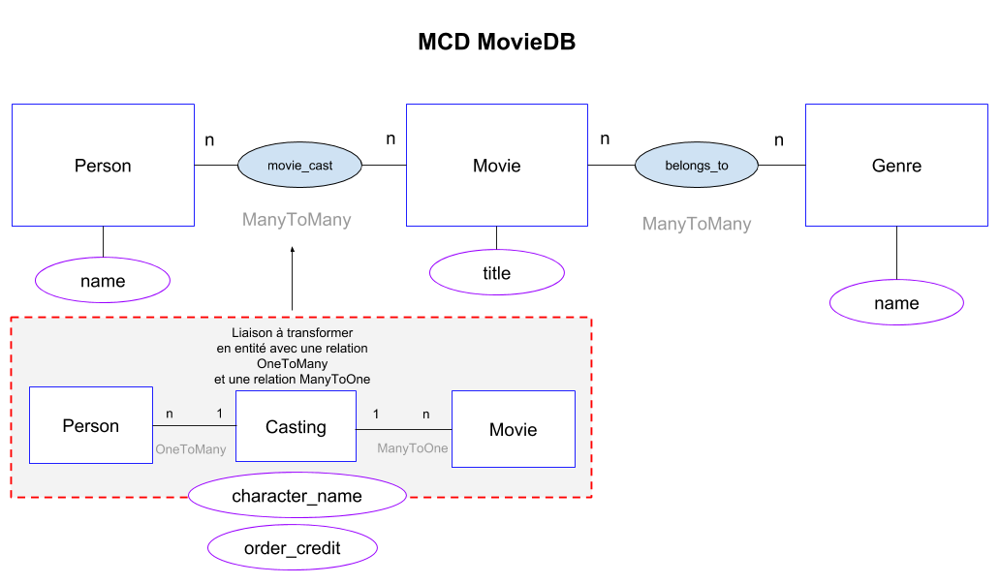

# Challenge Conversion ManyToMany

## Préambule

Après avoir cloné :

- Installer les vendors via `composer install`
- Exécuter les migrations en local chez vous via `php bin/console doctrine:migrations:migrate`

## Objectif

> Les entités Genre, Movie et Person sont déjà créées !

Créer une _vraie_ entité `Casting` avec des champs additionnels concernant le lien entre `Movie` et `Person`.  
L'idée est de convertir la relation `ManyToMany` en une vraie entité (classe PHP) `OneToMany/ManyToOne`, comme décrit sur ce schéma ci-dessous :

- Nous appellerons cette entité `Casting` et elle contiendra deux propriétés :
  - `characterName` : rôle de la personne dans le film.
  - `orderCredit` ordre d'affichage de ce rôle sur la fiche du film.
  - Et bien sûr les deux relations vers `Movie` et `Person` !
    - PS : n'oubliez pas de supprimer la relation ManyToMany d'origine dans chaque entité `Movie` et `Person` (propriété, construct, les 3 getters/setters)
  - Faites en sorte de créer le schéma Doctrine qui fonctionne (vérifiez dans le concepteur PMA si ça correspond).
  - En code, créez et ajoutez des personnes et des films à `Casting`, et sauvegardez-les en BDD.
  - Eventuellement, affichez la liste des films (voir route homepage).
  - Eventuellement, affichez le détail de chaque film avec TOUTES les infos liées disponibles.
    - Bonus ici : trouver le moyen de classer automatiquement les acteurs par ordre de `orderCredit`.

## Ressource

Si besoin, [tuto disponible sur le site de Doctrine](http://docs.doctrine-project.org/projects/doctrine-orm/en/latest/tutorials/composite-primary-keys.html#use-case-3-join-table-with-metadata) (cet exemple insiste plus particulièrement sur les clés primaires _composées_ de la table de jointure).
# Watch-It
